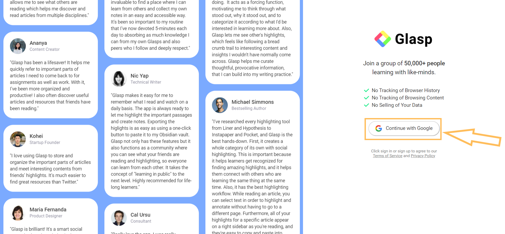
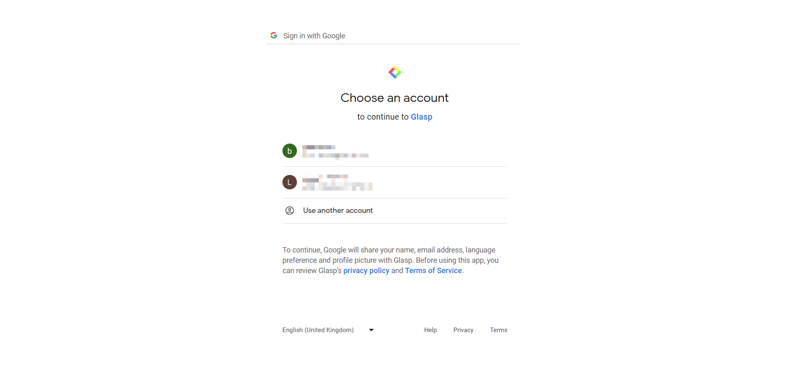

# Getting Started with Glasp - A Comprehensive Guide

## Introduction to Glasp

When visiting websites, how often do you feel the need to take note of information that strikes a chord on such sites for future reference? Taking note of such content would usually see you use a different application or service like Evernote, Google Keep, Notion, Obsidian, or something similar. While organizing your points and thoughts this way works, it can be a rather tedious and unintuitive procedure. What if you could highlight quotes, leave notes, and save specific points on a website directly on the site without leaving your browser or visiting a different website or app?

Enter [Glasp](https://glasp.co/), a social highlighter extension available on Chrome and MacOS. With Glasp, you no longer have to switch to a different app to highlight and save a quote or take note of something you saw on a site. Even more, Glasp wants to remedy "knowledge isolation" and allows you to share your findings, highlights, and quotes through Glasp's social feature. This guide intends to walk you through how to install and set up Glasp and how you can take advantage of its features. The rest of the article is structured thus:

- [Getting Started with Glasp - A Comprehensive Guide](#getting-started-with-glasp---a-comprehensive-guide)
  - [Introduction to Glasp](#introduction-to-glasp)
  - [How To Setup Glasp on Chrome](#how-to-setup-glasp-on-chrome)
    - [Sign Up and Install Glasp](#sign-up-and-install-glasp)
    - [How to Pin Glasp to Your Extension Toolbar](#how-to-pin-glasp-to-your-extension-toolbar)
  - [How To Use Glasp](#how-to-use-glasp)
    - [Your Glasp Profile Page](#your-glasp-profile-page)
    - [Save Text or Quote to Glasp](#save-text-or-quote-to-glasp)
    - [Add A Note to Highlighted Text](#add-a-note-to-highlighted-text)
    - [Create An Image of The Highlighted Text](#create-an-image-of-the-highlighted-text)
    - [Share Highlights Directly on Twitter](#share-highlights-directly-on-twitter)
    - [Delete Highlight from The Webpage](#delete-highlight-from-the-webpage)
    - [Take Note, Delete Highlight, Quoteshot, Share to Twitter, Copy Link to Highlight, Copy Highlight Embed Code from The Glasp Extension](#take-note-delete-highlight-quoteshot-share-to-twitter-copy-link-to-highlight-copy-highlight-embed-code-from-the-glasp-extension)
    - [Tag Highlights](#tag-highlights)
    - [Sort Through Your Highlights with Tags](#sort-through-your-highlights-with-tags)
    - [Summarize Text](#summarize-text)
    - [Copy All Highlights from A Website](#copy-all-highlights-from-a-website)
    - [Adjust Settings](#adjust-settings)
  - [Glasp's Shortcomings](#glasps-shortcomings)
  - [Conclusion](#conclusion)

## How To Setup Glasp on Chrome

This section will show you how to sign up and install Glasp's web browser extension and how to pin the extension to your browser's extension toolbar for easy access. You will need a Google account to sign up for Glasps service. Also, to use Glasp, you must install it as an extension or add-on to your browser. Currently, Glasp is compatible with desktop versions of Safari, Google Chrome, brave browser, or Microsoft Edge. Glasp should work on other Chrome-based browsers like Opera and Vivaldi. Note that this guide focuses on using Glasp on Chromium-based browsers and may not be effective for Safari.

### Sign Up and Install Glasp

To install Glasp, you must create a user account with Glasp and install the Glasp extension from the Chrome Web Store. Below are the steps to do both.

1. Visit [Glasp's website](https://glasp.co/) on your browser.
2. Click "Sign up (beta)" at the top right-hand corner of your screen. This action will redirect you to the signup page.
   
   _Sign Up on Glasp's Home Page_

3. Click "Continue with Google" on the right side of the signup page to sign up. Doing this will trigger a Google authentication sign-in page.
   
   _Continue with Google_

4. Select the Google account you want to sign in to Glasp with, or "Choose another account." Signing in will redirect you to the Glasp extension page on the Chrome Web Store.
   

   _Select a Google account to sign up to Glasp_

5. Visit [Glasp's Chrome extension page](https://chrome.google.com/webstore/detail/glasp-social-web-highligh/blillmbchncajnhkjfdnincfndboieik/related) if you were not redirected.
6. Click "Add to Chrome" on Glasp's Chrome extension page. It is in the top right-hand corner.
   
   _Add the Glasp extension to Chrome_

7. Select "Add extension" in the alert on your browser. Doing this will install Glasp on your browser.
   
   _Click "Add Extension" in the Alert_

### How to Pin Glasp to Your Extension Toolbar

Pinning the Glasp extension to the browser will enable easy access to the Glasp Sidebar and all of Glasp features. To pin Glasp to the extension toolbar:

1. Click the Chrome extension icon in the browser's toolbar. This will open a dropdown list of all extensions
   
   _Select the Chrome extension icon_

2. Look for Glasp in the dropdown list

   
   _Identify Glasp from the dropdown list_

3. Toggle the pin icon on. Now the Glasp extension should show up on the toolbar

   
   _Pin Glasp to the toolbar by clicking the pin icon_

4. Click on Glasp's extension icon to start it. The extension referred to as the "Glasp Sidebar" should take up a small portion of the right side of your browser window. You should be signed in. If you are not signed in, click _Log in / Sign up_ to proceed and follow steps 3 and 4 in [_Sign Up and Install Glasp_](#sign-up-and-install-glasp).
   
   _Glasp Sidebar signed in_

   
   _Not signed in? Click "Log in / Sign up" to proceed_

## How To Use Glasp

Glasp's purpose is to give you an intuitive way of saving quotes and taking note of information you find interesting. Making use of the web extension is easy. Below are Glasp's major features and how to use them.

### Your Glasp Profile Page

The Profile Page is where you can find all your highlights in one place. The ["Home"](https://glasp.co/home) feed on your profile page allows you to see highlighted texts from people you follow and those subscribed to the same topics as yourself. Your Glasp profile page also has a "My Highlights" feed that shows you your highlighted texts and an ["Explore"](https://glasp.co/explore/) feed that displays highlights from the Glasp community. To set up your profile page:

1. Go to your [Glasp profile page](https://glasp.co/home) by opening up the Glasp extension and clicking your avatar at the top-right side of the extension.
   
   _Glasp profile page_

2. Choose your favorite topics and click "save" to personalize your feed. You can choose up to 10 topics. After saving, you will see your profile page.
   
   _Select your favorite topics_

3. Customize the feed by selecting a particular topic from the left-hand side of the home page.
   
   _Customize your home feed with a topic_

4. Find all your highlights in "My Highlights."

### Save Text or Quote to Glasp

The most crucial feature of the Glasp extension is highlighting and saving quotes or text you find interesting on a website. Also, saving text or quotes on Glasp allows you to perform other actions on your saved quotes. To save a quote

1. ==Highlight text== on a website as you usually would
   
   _Highlight a text_

2. Select the color of choice from the menu that pops up. Doing this will save the text to your Glasp profile
   
   _Save the highlight with a color_

3. Click the Glasp icon in the extension toolbar to view your saved highlights
   
   _Open Glasp Sidebar or extension to see your highlights_

### Add A Note to Highlighted Text

You can add notes to text or quotes you have highlighted. To Add a note:

1. Highlight the text you want or click on the text you have previously highlighted
2. Select the note-writing icon "✍️" from the menu, as seen in the image below.
   
   _Select the note-writing icon_

3. Add a comment in the text box underneath the highlight in the Glasp extension. Glasp automatically saves the text
   
   _Input a comment in the text box_

4. Use Shift and enter on your keyboard to start a new line of text
5. Clear notes by undoing or deleting the text

### Create An Image of The Highlighted Text

A remarkable feature that Glasp has is "Create a Quoteshot." A Quoteshot allows you to generate an image from the text you highlighted. To create a Quoteshot:

1. Click an already highlighted text to display the menu
2. Tap the quote icon from the menu to create a Quoteshot. A card with the image will pop up
   
   _Select the quote icon from the menu_

3. Customize the image color and orientation in the card that pops up
4. Download or share the image on Twitter or Facebook with the buttons at the bottom right side of the card
5. Exit the Quoteshot with the close button marked "X" at the top right-hand corner of the card
   
   _Change orientation or color and download or share a Quoteshot_

### Share Highlights Directly on Twitter

Suppose you want to share a highlighted text on Twitter. You do not have to copy the text or quote and paste it. Instead, you can directly share the quote to Twitter using Glasp's "Share on Twitter" feature. You must be logged in to your Twitter account on your browser for this feature to work. To share to Twitter:

1. Click a highlighted text
2. Click the Twitter icon from the highlight popup. Doing this will open up a new window on Twitter with the quote and the website you got it from
   
   _Click the Twitter icon from the Highlight Popup_

3. Click "Tweet" to post to your Twitter profile.
   
   _Hit tweet to share to Twitter_

### Delete Highlight from The Webpage

1. Click on the text you highlighted
2. Select the color you used in highlighting the text to delete it. The color will have an "X" sign on top of it
   
   _Delete a highlight by clicking the color marked "X"_

### Take Note, Delete Highlight, Quoteshot, Share to Twitter, Copy Link to Highlight, Copy Highlight Embed Code from The Glasp Extension

Once you have created a highlight, you can access or perform most of the features we previously discussed from the Glasp extension. This way, you can be off the website where the quote is from and still perform any of these operations. From here, to do this:

1. Click on the Glasp icon in the extension toolbar to open the extension
2. Place your cursor over the highlight you want to add a note, delete, or share on Twitter
3. Click the three-dotted menu in the top right corner of the highlights card
   
   _Select the three dotted menu icon_

4. Choose the feature you want to use from the menu that comes up
   
   _Select a feature to use from the menu_

5. Select copy link to highlight to copy to your clipboard a link to the highlight
6. Select copy highlight embed code to copy to your clipboard HTML code that you can integrate into your code, blog or newsletter

```
<iframe width="100%" height="315" src="https://glasp.co/highlight-embed?u=AiuA10kbaXQ6trgzPut0tnVwSif1&d=6fLhaHg0ftR1Fi8QVbd6&h=fyrb6j8o7527x3ed&m=h" title="Glasp Highlight Embed" frameborder="0"></iframe>
```

_Example of a copied highlight embed code_

### Tag Highlights

Glasp allows you to label highlights with tags for easy categorization. To tag a highlight:

1. Click the highlighted text to see the highlight popup
2. Select the tag icon 🏷️
   
   _Click the tag icon_

3. Enter your preferred tag name in the textbox on the top of the Glasp extension
   
   _Enter a tag name_

   
   _Saved tag name_

### Sort Through Your Highlights with Tags

Glasp's tag feature is handy when you want to sift through a large amount of content you have highlighted and tagged. You can filter out your highlights from your highlights page with a tag. To do this:

1. Open up the Glasp extension
2. Click the Settings and Help button "⚙️" on the right-hand corner of the Glasp extension
   
   _Click settings and help icon_

3. Select "See My Highlights." This will open your highlights page in a new tab
   
   _Pick See My Highlights_

4. Filter your highlights with a tag by selecting it from the tag section of the highlights page
   
   _Click a tag to filter your highlights_

### Summarize Text

Glasp has a neat feature that allows you to summarize the highlighted text. It is named "View Ai Summary." It leverages artificial intelligence (AI) to give you a summary of the text you highlighted. To use it:

1. Highlight the text
2. Open the Glasp extension
3. Click View AI Summary in the Glasp extension
   
   _View AI Summary button_

4. Wait 5 – 10 seconds for Glasp to produce the summary
   
   _Summarized text output_

5. Click the copy or Twitter icon to copy the summary or share it on Twitter, respectively.

### Copy All Highlights from A Website

You can copy all the highlights you have saved from a website on Glasp. Glasp's "Copy All" feature saves to your device's clipboard text in Markdown format, the page title, an image, the page's metadata, and all your highlights in a list format. To use this feature:

1. Open the Glasp extension
2. Select "Copy All" to copy all of your highlights to the clipboard
   
   _Select Copy All_

3. Paste it where you need it.
   
   _Copy highlights example_

### Adjust Settings

Open Glasp settings by right-clicking the Glasp icon in your browser's extensions toolbar and selecting options.

_Right-click the Glasp extension icon and select options_

Alternatively, open the Glasp extension by clicking the settings icon at the bottom right side and selecting "User Settings." You can adjust the extension's theme, copy format, language, and more from the settings.

_Alternate way of opening glasp settings: Click settings icon_


_Settings Page
_

## Glasp's Shortcomings

Despite all of its great features, at the time of publishing this guide, Glasp has some limitations you should be aware of. They include:

- Inability to share highlights directly to other social media platforms besides Twitter from the Glasp sidebar or popup menu.
- Glasp will not work on specific domains, including domains from major platforms like Google, Instagram, your Glasp profile page, other note-taking apps, and more. In addition, Glasp will not work with your local PDF documents.
- There is no tight integration with other note-taking, research, and referencing applications. Although there are tutorials on Glasp's website for [sharing highlights to Notion, Roam Research, and Obsidian](https://glasp.co/welcome#:~:text=Glasp%20with%20Obsidian,with%20Roam%20Research), they only teach you how to copy and paste from their platform to the other. There is tighter integration with [Readwise](https://medium.com/glasp/tutorial-how-to-export-web-highlights-into-readwise-2311e85ccaca).
- Glasp's extension does not work offline. You will need an internet connection to utilize Glasp.
- Glasp is not available on Mozilla Firefox. The developers mention that they will work on an [add-on for Mozilla Firefox](https://blog.glasp.co/faqs/#:~:text=As%20of%20December%2015th%2C%202022%2C%20the%20answer%20is%20no.%20We%20have%20the%20extension%20for%20Chrome%2C%20Brave%2C%20Microsoft%20Edge%2C%20Safari%2C%20Opera%2C%20and%20Vivaldi.%20We%27re%20going%20to%20develop%20it%20for%20Firefox%2C%20but%20we%20cannot%20guarantee%20when%20it%27ll%20be%20released%2C%20so%20please%20bear%20with%20us).
- You can only sign up for Glasp with a Google account.

## Conclusion

Glasp is a clever web browser extension that allows you to highlight, save and add notes to quotes and texts directly on a website. With Glasp, you can eliminate the need to switch between applications or websites to keep track of relevant information. Glasp’s social features promote knowledge sharing and collaboration, making it an excellent tool for students, researchers, and professionals. Its features are impressive even if you are a casual user.

The guide provides steps to set up and use Glasp. In addition, this guide presents the major features of the Glasp extension. These features include setting up your home feed, saving text or quotes to Glasp, adding notes to highlighted texts, and creating images from those highlights. Despite some shortcomings, Glasp makes it easy to stay organized, collaborate with others, and gain and share insights.
