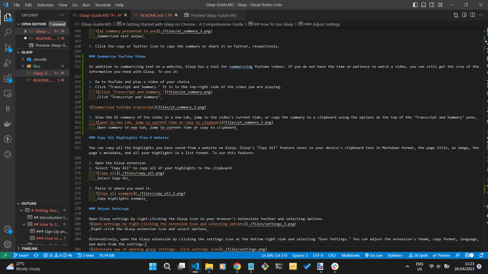

# Glasp-Guide

[This project](Glasp-Guide.MD) is the second task in [Technical Writing Mentorship Program](https://twitter.com/TechnicalWriti6) organized by [Wisdom Nwokocha](https://www.linkedin.com/in/wisdom-nwokocha-76212a77/). This guide describes installation procedures and feature usage for the [Glasp](https://chrome.google.com/webstore/detail/glasp-social-web-highligh/blillmbchncajnhkjfdnincfndboieik/related) social web highlighter extension.

## Project Instructions

In this task, you will write an article covering everything about [Glasp](https://glasp.co/) and how to use it.

- Do the following:
- Generate the table of content.
- Choose a suitable title.
- Write in Markdown.
- Create a repo on GitHub.
- Create a Markdown file explaining your assignment.
- Create a new markdown file that will contain your assignment.
- Use vscode to write and test your markdown (Send a screenshot of your vscode containing your assignment)
- Submit your Github repo URL.

- This article should have the following.
- Arrange the order of the content.
- Attention to details
- Work on the information architecture
- It should be over 1000 words
- No plagiarism
- Don’t use AI-generated content
- Your audience is a novice
- Proper citation
- No grammatical or spelling error
- No repetitive and filler words
- Must have necessary images
- Use the Google Writing style guide

After review, tag Glasp on Twitter and Linkedin, mentioning it's your second task from the technical writing mentorship program organized by @TechnicalWriti6 on your Twitter handle or LinkedIn.

## VS Code Screenshots

_Screenshot 1_

_Screenshot 1_

_Screenshot 2_

_Screenshot 3_
